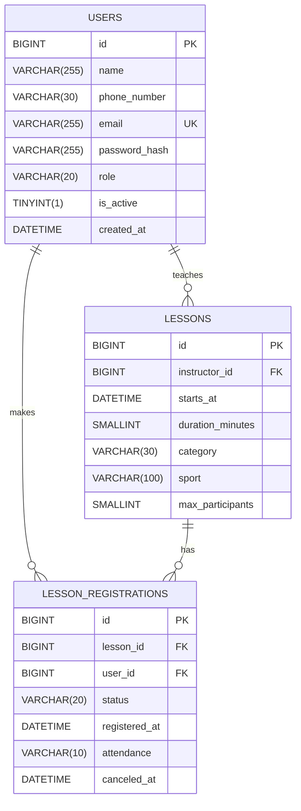

# Plan van eisen

## Teamgegevens

| Gegeven       | Waarde                                                                                 |
| ------------- | -------------------------------------------------------------------------------------- |
| Team          | —                                                                                      |
| Opdrachtgever | Ron de Wit, Sportcentrum De Linde                                                      |
| Repository    | [Sportcentrum-backend](https://github.com/vvendorrr/sportcentrum-backend "Repository") |
| Versie        | 1.6                                                                                    |
| Datum         | 25-09                                                                                  |

## Teamleden, rollen en deelproducten

| Naam     | Studentnummer | Scrum-rol     | Deelproduct        |
| -------- | ------------- | ------------- | ------------------ |
| Famke    | D315950       | Product owner | [Nog in te vullen] |
| Giovanni | D316667       | Scrum master  | [Nog in te vullen] |
| Lucas    | D310739       | Developer     | [Nog in te vullen] |

## Versiebeheer

| Versie | Datum | Wat is er gewijzigd                         | Door wie |
| ------ | ----- | ------------------------------------------- | -------- |
| 1.0    | 25/09 | Eerste versie                               | Famke    |
| 1.1    | 02/10 | .                                           | Famke    |
| 1.2    | 09/10 | Inleiding en doel verbeterd                 | Giovanni |
| 1.3    | 09/10 | Doelgroepen ingevuld                        | Giovanni |
| 1.4    | 09/10 | Basis ERD ingevuld, nheeft herziening nodig | Giovanni |
| 1.5    | 09/10 | Pagina’s en wireframe tabel ingevuld        | Giovanni |
| 1.6    | 09/10 | Studentennummers volledig ingevuld          | Giovanni |

## Inleiding

### De opdrachtgever en het probleem

De opdrachtgever is Ron de Wit, manager van Sportcentrum De Linde. Het sportcentrum heeft enkele honderden leden en organiseert wekelijks veel groepslessen.

De inschrijvingen en afmeldingen worden nu telefonisch en op papieren lijsten bijgehouden. Daardoor raken lessen soms overboekt, worden afmeldingen gemist en blijven plekken onnodig leeg. Trainers weten vooraf niet hoeveel deelnemers er komen en de manager heeft geen overzicht van de bezetting.

### Doel van website

De website geeft leden een duidelijk overzicht van de groepslessen en laat hen online inschrijven of afmelden. Zo blijft het aantal inschrijvingen binnen de beschikbare capaciteit en kunnen trainers en beheerders vooraf zien hoeveel deelnemers er worden verwacht.

### Scope

| Wel binnen dit project | Bewust buiten dit project |
| ---------------------- | ------------------------- |
| [Nog in te vullen]     | [Nog in te vullen]        |

### Doelgroepen

| Gebruiker         | Wat doet deze persoon op de website                                                                                                                       |
| ----------------- | --------------------------------------------------------------------------------------------------------------------------------------------------------- |
| Bezoeker          | Bekijkt het lesrooster en per les het aantal inschrijvingen, zonder de namen te zien. Kan een account aanmaken.                                           |
| Lid               | Schrijft zich in voor lessen en kan zich afmelden.                                                                                                        |
| Beheerder/Trainer | Maakt lessen aan en plant ze in het rooster, bekijkt wie zich heeft ingeschreven, ziet hoe vaak leden een les hebben gemist en kan accounts uitschakelen. |

## Functionele eisen

### Overzicht van de user stories

| ID                 | User story         | Deelproduct        | Prioriteit         | Sprint             | Wie                |
| ------------------ | ------------------ | ------------------ | ------------------ | ------------------ | ------------------ |
| [Nog in te vullen] | [Nog in te vullen] | [Nog in te vullen] | [Nog in te vullen] | [Nog in te vullen] | [Nog in te vullen] |

### Uitgewerkte user stories

#### [ID] — [Titel] — [Prioriteit] — [Deelproduct] — [Naam]

> **Als** ~~rol~~ wil ik ~~wat~~ zodat ~~waarom~~

**Acceptatiecriteria**

- [ ] Testbaar criterium
- [ ] Testbaar criterium
- [ ] Testbaar criterium

#### [ID] — [Titel] — [Prioriteit] — [Deelproduct] — [Naam]

> **Als** ~~rol~~ wil ik ~~wat~~ zodat ~~waarom~~

**Acceptatiecriteria**

- [ ] Testbaar criterium
- [ ] Testbaar criterium
- [ ] Testbaar criterium

## Niet-functionele eisen

| Nr.                | Eis                | Hoe controleren we dit? |
| ------------------ | ------------------ | ----------------------- |
| [Nog in te vullen] | [Nog in te vullen] | [Nog in te vullen]      |

## Technische eisen en randvoorwaarden

| Onderwerp      | Afspraak                                                        |
| -------------- | --------------------------------------------------------------- |
| Framework      | Laravel 13                                                      |
| Views          | Blade-views met één gedeelde layout; geen React, Vue of Inertia |
| Database       | alle tabellen via migrations, gevuld met seeders                |
| Authenticatie  | Met de rollen lid en beheerder                                  |
| Validatie      | Form Requests met Nederlandstalige meldingen                    |
| Testen         | Minimaal 10 feature tests met _Pest / PHPUnit_                  |
| Versiebeheer   | GitHub, branches per user story, pull requests met review       |
| Overige keuzes | [Nog in te vullen]                                              |

## Datamodel

De `id`- en foreign-keykolommen zijn `BIGINT UNSIGNED`; `duration_minutes` en `max_participants` zijn `SMALLINT UNSIGNED`. `attendance` en `canceled_at` zijn nullable. De waarden voor `role` zijn `member` en `admin`; voor `category` zijn dit `strength`, `cardio` en `relaxation`; `status` gebruikt `enrolled`, `waitlisted` en `cancelled`; `attendance` gebruikt `attended` en `absent`.

| Entiteit               | Belangrijkste velden                                                                                                                       | Relaties                                                                                                                                             |
| ---------------------- | ------------------------------------------------------------------------------------------------------------------------------------------ | ---------------------------------------------------------------------------------------------------------------------------------------------------- |
| `users`                | `name`, `phone_number`, `email`, `password_hash`, `role` (`member`/`admin`), `is_active`, `created_at`                                     | Een beheerder/trainer kan meerdere lessen geven. Een gebruiker kan zich voor meerdere lessen inschrijven.                                            |
| `lessons`              | `instructor_id`, `starts_at`, `duration_minutes`, `category`, `sport`, `max_participants`                                                  | Een les heeft één trainer en kan meerdere inschrijvingen hebben.                                                                                     |
| `lesson_registrations` | `lesson_id`, `user_id`, `status` (`enrolled`/`waitlisted`/`cancelled`), `registered_at`, `attendance` (`attended`/`absent`), `canceled_at` | Koppelt een gebruiker aan een les. Een gebruiker kan per les maximaal één inschrijving hebben; een afgemelde inschrijving kan opnieuw actief worden. |

**Afspraken en regels**

- Het maximaal aantal deelnemers wordt per les opgeslagen. Richtwaarden zijn 16 voor spinning, 12 voor yoga en 20 voor aquagym/zwemlessen.
- Als een les vol is, krijgt een nieuwe inschrijving de status wachtlijst. Bij een vrijgekomen plek wordt de eerstvolgende op de wachtlijst automatisch ingeschreven.
- Een lid kan zichzelf tot twee uur voor aanvang afmelden. Een beheerder/trainer kan een deelnemer ook later afmelden.
- Een beheerder/trainer registreert na de les wie aanwezig of afwezig was. Het aantal gemiste lessen per lid kan worden berekend uit diens afwezigheidsregistraties.

## Pagina's en wireframes

| Pagina                  | Deelproduct        | Toegankelijk voor                                                          | Wireframe                    | Goedgekeurd op     |
| ----------------------- | ------------------ | -------------------------------------------------------------------------- | ---------------------------- | ------------------ |
| Homepagina              | [Nog in te vullen] | Bezoeker, lid en beheerder                                                 | Home page                    | [Nog in te vullen] |
| Inloggen en registreren | [Nog in te vullen] | Bezoeker (niet ingelogd)                                                   | Register/Signup              | [Nog in te vullen] |
| Accountinstellingen     | [Nog in te vullen] | Ingelogd lid en beheerder                                                  | Settings                     | [Nog in te vullen] |
| Uitloggen (actie)       | [Nog in te vullen] | Ingelogd lid en beheerder                                                  | Navigatie; geen apart scherm | [Nog in te vullen] |
| Rooster                 | [Nog in te vullen] | Bezoeker, lid en beheerder; bezoekers zien alleen aantallen inschrijvingen | Rooster                      | [Nog in te vullen] |
| Deelnemers beheren      | [Nog in te vullen] | Beheerder/trainer                                                          | Deelnemers                   | [Nog in te vullen] |
| Trainers beheren        | [Nog in te vullen] | Beheerder/trainer                                                          | Trainers                     | [Nog in te vullen] |

## Afspraken met de klant

| Nr.                | Datum              | Afspraak           | Aanleiding         |
| ------------------ | ------------------ | ------------------ | ------------------ |
| [Nog in te vullen] | [Nog in te vullen] | [Nog in te vullen] | [Nog in te vullen] |

### Openstaande vragen

| Vraag              | Aan wie            | Sinds              | Status             |
| ------------------ | ------------------ | ------------------ | ------------------ |
| [Nog in te vullen] | [Nog in te vullen] | [Nog in te vullen] | [Nog in te vullen] |

## Wijzigingenlog

| Nr.                | Wat verandert er   | Gevolg voor planning of scope | Akkoord klant      |
| ------------------ | ------------------ | ----------------------------- | ------------------ |
| [Nog in te vullen] | [Nog in te vullen] | [Nog in te vullen]            | [Nog in te vullen] |

## Akkoord

| Namens               | Naam               | Datum              | Akkoord            |
| -------------------- | ------------------ | ------------------ | ------------------ |
| Namens het team (PO) | [Nog in te vullen] | [Nog in te vullen] | [Nog in te vullen] |
| Opdrachtgever        | Ron de Wit         | [Nog in te vullen] | [Nog in te vullen] |
